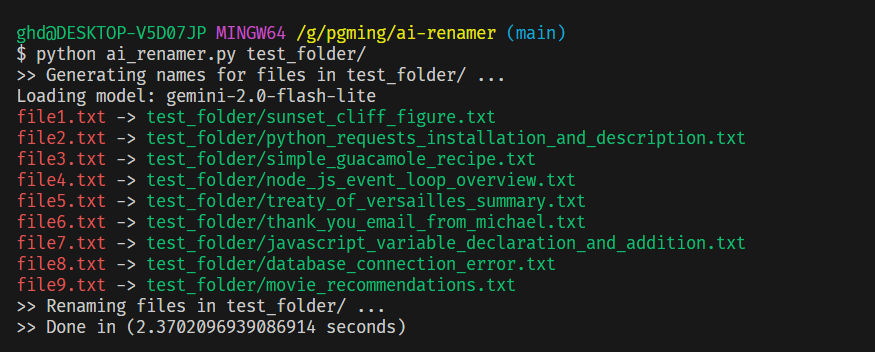

# AI File Renamer

A Python script that generates a descriptive name for a file based on its content using AI.



## Features

- Generates a descriptive name for a file based on its content using AI
- Uses `LangChain` so supports any LLM
- Asynchronously generates names for multiple files using `asyncio`
- Tested with `Ollama` and Google `Gemini` models

## Installation

```bash
pip install -r requirements.txt
```

## Usage

```bash
python ai-renamer.py [folder-path]
```

## Examples

<span style="color:#e84741">file8.txt</span> ->
<span style="color:#108327">database_connection_error.txt</span>

```log
Error: Unable to connect to the database. Please check your credentials and try again.

```

<hr>


<span style="color:#e84741">file3.txt</span> ->
<span style="color:#108327">simple_guacamole_recipe.txt</span>

```
Ingredients:
- 2 ripe avocados
- 1 lime
- Salt to taste
Mash the avocados and mix in the lime juice and salt. Serve with chips.
```

<hr>


<span style="color:#e84741">file7.txt</span> ->
<span style="color:#108327">javascript_variable_declaration_and_additionr.txt</span>

```js
var x = 10;  
let y = 20;  
const z = x + y;  
console.log(z);
```

<hr>

<span style="color:#e84741">file9.txt</span> ->
<span style="color:#108327">movie_recommendations.txt</span>

```text
If you're looking for something to watch, here are a few solid picks:
- The Shawshank Redemption
- Parasite
- Interstellar 
- Knives Out
- Into the Spider-Verse
Let me know if you want more!
```

By Gholamreza Dar 2025
